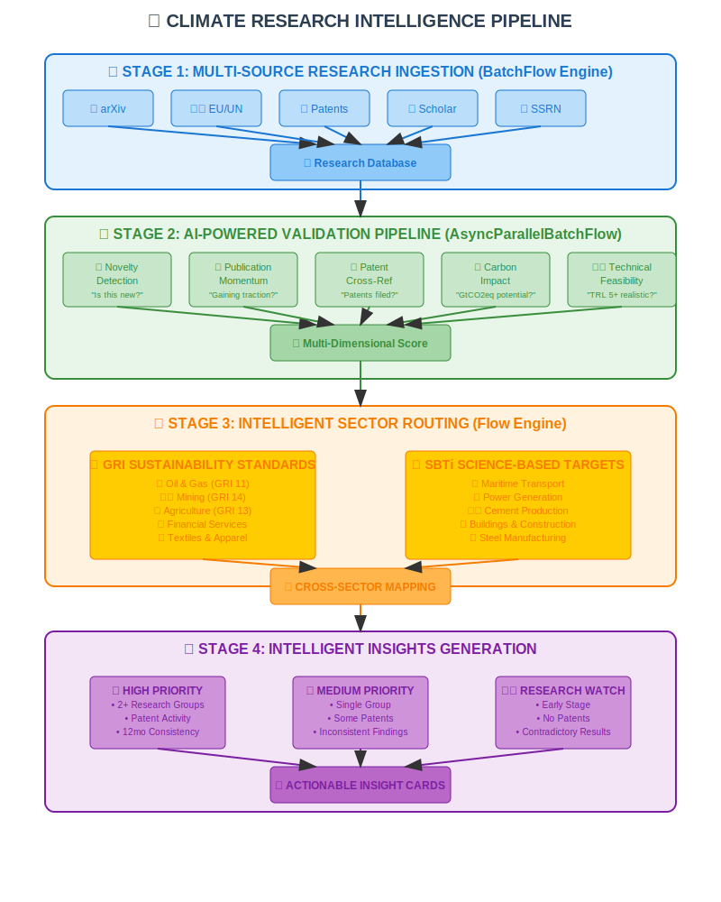
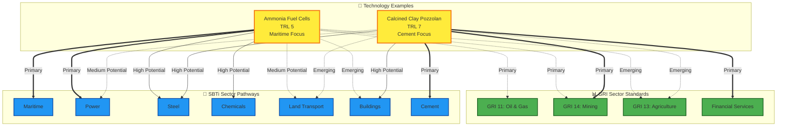

🌍 PocketFlow: Experimental Mitigation Strategy Tracker (SBTi Edition)

*Built on the 100-line minimalist LLM framework for maximum efficiency and zero vendor lock-in*

A lightweight, modular research ingestion engine leveraging **PocketFlow's core graph abstraction** to continuously discover, evaluate, and integrate cutting-edge climate mitigation strategies.
This specialized implementation harnesses PocketFlow's **BatchFlow**, **AsyncParallelBatchFlow**, and **multi-stage workflow patterns** to support Science Based Targets initiative (SBTi) alignment:

**🔄 Core PocketFlow Engines Utilized:**
- **BatchFlow**: Parallel processing of multiple research sources
- **AsyncParallelBatchFlow**: Concurrent paper scraping and classification  
- **Multi-Stage Workflows**: Sequential validation pipeline with branching logic
- **Tool Integration**: Seamless external API connections (patents, institutional DBs)
- **Error Handling**: Built-in retry mechanisms for unreliable data sources

⸻

📌 Use Case

If you're:
    •    A sustainability strategist exploring emerging mitigation technologies (e.g. direct ocean capture, synthetic fuels, advanced MRV),
    •    A policy researcher looking for experimental decarbonization strategies aligned with SBTi sector guidance,
    •    A net-zero team needing to track, validate, and recommend actionable research across hard-to-abate sectors…

This fork gives you an AI-assisted, automated way to do just that.

⸻

🧭 **PocketFlow-Powered Workflow Architecture**

<!-- TO CREATE THIS DIAGRAM: -->
<!-- 1. Go to draw.io or lucidchart.com -->
<!-- 2. Create a new flowchart with these elements: -->



> **✅ Professional Pipeline Diagram**: *4-stage climate research intelligence workflow with PocketFlow engine integration*

### **Draw.io/Lucidchart Diagram Specifications:**

**🎨 Visual Design Elements:**
- **Color Scheme**: Blue gradient (#2196F3 to #1976D2) for professional tech aesthetic
- **Icons**: Use Font Awesome or similar icon library
- **Layout**: Vertical flow with 4 distinct stages
- **Styling**: Rounded rectangles with drop shadows

**📊 Stage Layout Details:**

**Stage 1: Multi-Source Ingestion** (Top - Light Blue Background)
```
┌─ 🔬 arXiv ─┐  ┌─ 🏛️ EU/UN ─┐  ┌─ 📊 Patents ─┐  ┌─ 🎓 Scholar ─┐  ┌─ 📈 SSRN ─┐
│  Papers    │  │ Reports    │  │ Databases   │  │ Search      │  │Preprints │
└─────┬──────┘  └─────┬──────┘  └─────┬───────┘  └─────┬───────┘  └────┬─────┘
      └──────────────────┬──────────────────┬──────────────────┬─────────────┘
                         ▼
                   📦 Research Database
                 (Tagged & Categorized)
```

**Stage 2: AI Validation Pipeline** (Light Green Background)  
```
           📦 Research Database
                     │
    ┌────────────────┴────────────────┐
    ▼                ▼               ▼               ▼               ▼
🔍 Novelty      📈 Publication   📋 Patent      💡 Carbon      ⚖️ Technical
Detection       Momentum         Cross-Ref     Impact         Feasibility
    │                │               │             │               │
"Is this new?"  "Gaining        "Patents     "GtCO2eq      "TRL 5+
                traction?"       filed?"     potential?"   realistic?"
    └────────────────┬────────────────┬───────────────┬───────────────┘
                     ▼
              🎯 Multi-Dimensional Score
           (Novelty×Momentum×Impact×Feasibility)
```

**Stage 3: Sector Routing** (Light Orange Background)
```
              🎯 Validation Score
                     │
        ┌────────────┴────────────┐
        ▼                         ▼
📊 GRI SUSTAINABILITY      🎯 SBTi SCIENCE-BASED
   STANDARDS                  TARGETS
┌─────────────────┐        ┌─────────────────┐
│🏭 Oil & Gas     │        │⚓ Maritime       │
│⛏️ Mining         │        │⚡ Power          │
│🌾 Agriculture   │        │🏗️ Cement         │
│💰 Financial     │        │🏢 Buildings     │
│🧵 Textiles      │        │🚢 Steel         │
└─────────────────┘        └─────────────────┘
        └────────────┬────────────┘
                     ▼
         🔀 CROSS-SECTOR MAPPING
    (Primary → High → Medium → Emerging)
```

**Stage 4: Insights Generation** (Light Purple Background)
```
           🔀 Cross-Sector Mapping
                     │
        ┌────────────┼────────────┐
        ▼            ▼            ▼
   ⭐ HIGH       📈 MEDIUM    👁️ WATCH
   PRIORITY     PRIORITY     LIST
┌─────────────┐ ┌───────────┐ ┌─────────┐
│2+ Groups    │ │1 Group    │ │Early    │
│Patents      │ │Some       │ │Stage    │
│Consistent   │ │Patents    │ │No       │
│             │ │           │ │Patents  │
└─────────────┘ └───────────┘ └─────────┘
        └────────────┼────────────┘
                     ▼
            📋 INSIGHT CARDS
       🏗️ Sector Recommendations
         📊 Compliance Mapping
```

**🎯 Alternative: Quick Image Creation Options:**

1. **AI Image Generator Prompt**: 
   ```
   "Create a professional technical flowchart showing a 4-stage climate research pipeline: 
   Stage 1 (blue): Multiple research sources feeding into database
   Stage 2 (green): 5 parallel AI validation processes  
   Stage 3 (orange): Dual sector classification (GRI & SBTi)
   Stage 4 (purple): 3-tier priority routing to insight cards
   Clean, modern design with icons and connecting arrows"
   ```

2. **Canva Template**: Search for "Process Flow" templates and customize
3. **Figma Community**: Look for "Technical Architecture" templates

**📝 Next Steps:**
- Replace placeholder image with actual Draw.io/Lucidchart creation
- Save as PNG/JPG and upload to GitHub repository  
- Update image source path in README

1️⃣ **BatchFlow-Powered Source Ingestion**

Leveraging PocketFlow's **BatchNode** architecture, we concurrently process multiple source APIs with built-in retry logic and error handling:

| **Type** | **Sources** | **Primary URLs** |
|----------|-------------|------------------|
| **Academic Search Engines** | Google Scholar, Semantic Scholar, BASE, Microsoft Academic (archived) | [scholar.google.com](https://scholar.google.com), [semanticscholar.org](https://www.semanticscholar.org), [base-search.net](https://www.base-search.net) |
| **Institutional/Government** | UNFCCC, EU Publications, IEA, OECD, World Bank, NASA EarthData | [unfccc.int/documents](https://unfccc.int/documents), [op.europa.eu](https://op.europa.eu/en/home), [iea.org/reports](https://www.iea.org/reports), [oecd-ilibrary.org](https://www.oecd-ilibrary.org), [openknowledge.worldbank.org](https://openknowledge.worldbank.org), [earthdata.nasa.gov](https://earthdata.nasa.gov) |
| **Patent & Innovation** | Google Patents, Espacenet (EPO), WIPO Patentscope, USPTO | [patents.google.com](https://patents.google.com), [worldwide.espacenet.com](https://worldwide.espacenet.com), [patentscope.wipo.int](https://patentscope.wipo.int), [patft.uspto.gov](https://patft.uspto.gov) |
| **Climate/Energy Journals** | Nature Climate Change, Environmental Research Letters, Joule (Cell Press), Climatic Change, Renewable & Sustainable Energy Reviews | [nature.com/nclimate](https://www.nature.com/nclimate), [iopscience.iop.org/journal/1748-9326](https://iopscience.iop.org/journal/1748-9326), [cell.com/joule](https://www.cell.com/joule) |
| **Preprints** | arXiv, SSRN, EarthArXiv, TechRxiv | [arxiv.org](https://arxiv.org), [ssrn.com](https://www.ssrn.com), [eartharxiv.org](https://eartharxiv.org), [techrxiv.org](https://www.techrxiv.org) |

🔧 Each source is defined in sources.yaml and can be toggled or extended as needed.

⸻

2️⃣ **Multi-Stage AsyncParallelBatchFlow Validation**

Using PocketFlow's **AsyncParallelBatchFlow** engine, we implement a sophisticated validation pipeline:

```python
# PocketFlow Pipeline Architecture
class ValidationFlow(AsyncParallelBatchFlow):
    def prep_async(self, shared):
        return [
            {"stage": "relevance", "model": "gpt-4o-mini"},
            {"stage": "novelty", "model": "semantic-similarity"},
            {"stage": "feasibility", "model": "domain-specific"},
            {"stage": "impact", "model": "carbon-modeling"}
        ]
```

**Multi-Dimensional Scoring Output:**
```json
{
  "technical_novelty": 0.85,
  "carbon_impact": 0.72, 
  "implementation_speed": 0.45,
  "cost_competitiveness": 0.60,
  "regulatory_readiness": 0.30,
  "early_signal_strength": 0.88,
  "gri_sectors": ["Oil & Gas", "Mining"],
  "sbti_pathways": ["Maritime", "Chemicals"],
  "cross_sector_applicability": {
    "primary": "Maritime",
    "secondary": ["Power", "Steel"],
    "emerging": ["Agriculture"]
  },
  "strategy": "Ammonia fuel cells",
  "maturity": "TRL 5"
}
```


⸻

3️⃣ **Flow-Orchestrated Knowledge Integration**

Using PocketFlow's **Flow** engine with conditional branching, validated research integrates into structured knowledge graphs:

```python
# GRI/SBTi Sector-Aware Conditional Flow Logic
class SectorIntegrationFlow(Flow):
    def __init__(self):
        sector_classifier = SectorClassificationNode()
        gri_router = GRISectorRoutingNode()
        sbti_router = SBTiSectorRoutingNode()
        cross_sector_mapper = CrossSectorMappingNode()
        integration_node = KnowledgeIntegrationNode()
        
        # Multi-sector routing pipeline
        sector_classifier >> gri_router
        sector_classifier >> sbti_router  
        gri_router >> cross_sector_mapper
        sbti_router >> cross_sector_mapper
        cross_sector_mapper >> integration_node
```

**GRI/SBTi-Aligned Knowledge Graph Structure:**
- 🔍 **GRI Sector Standards** (4 Published + 36 Planned): Oil & Gas, Coal, Agriculture/Aquaculture/Fishing, Mining, Financial Services, Textiles
- 🎯 **SBTi Sector Pathways** (11 Available): Power, Cement, Steel, Chemicals, Maritime, Aviation, Land Transport, Buildings, FLAG, Apparel, Oil & Gas
- 🧪 **Cross-Sector Strategy Mapping**: Technologies applicable across multiple GRI/SBTi classifications
- 📈 **Sector-Specific Innovation Tracking**: TRL progression, funding signals, pilot deployments by industry
- 🧠 **Intelligent Sector Routing**: Auto-classification to relevant GRI/SBTi frameworks

**Example Insight Cards:**

**🌊 Marine Alkalinity Enhancement**
*Paper: 2025, EarthArXiv*
➕ TRL 4 pilot off coast of Sulawesi
➕ Models show 1.4 Gt CO₂eq annual removal potential
➕ Requires new SBTi guidance on ocean-based removals

**🏗️ Calcined Clay Pozzolan Cement**
*Papers: 15 recent publications (2024)*
➕ TRL 7 - Commercial deployment in 12 countries
➕ 30-50% clinker replacement → 0.8-2.1 GtCO2eq/year reduction
➕ Cross-sector potential: Buildings (structural concrete), Steel (refractory applications)
➕ GRI Mining & Financial Services alignment for ESG reporting
⚠️ Supply chain constraints in high-quality clay deposits
📊 SBTi Cement pathway compliant, Buildings pathway emerging

⸻

📂 **PocketFlow-Native Architecture**

```
📁 flows/                    # PocketFlow orchestration engines
   └── ingestion_flow.py     # BatchFlow for source processing
   └── validation_flow.py    # AsyncParallelBatchFlow pipeline
   └── integration_flow.py   # Flow with conditional routing

📁 nodes/                    # PocketFlow processing nodes
   └── scraper_nodes.py      # BatchNode implementations
   └── validation_nodes.py   # AsyncNode validation stages
   └── integration_nodes.py  # Knowledge graph update nodes

📁 tools/                    # External integrations
   └── patent_api.py         # Patent database connectors
   └── semantic_search.py    # Similarity matching tools
   └── carbon_modeling.py    # Impact assessment tools

📁 config/                   # Flow configurations
   └── sources.yaml          # BatchFlow source definitions
   └── validation.yaml       # Multi-stage pipeline config
   └── gri_sectors.yaml      # GRI 40-sector classification mapping
   └── sbti_pathways.yaml    # SBTi 11-pathway sector routing
   └── cross_sector.yaml     # Technology cross-applicability matrix
```

**🎯 GRI/SBTi Sector Integration Features**

**Multi-Framework Classification:**
- Simultaneous mapping to GRI sector standards AND SBTi pathways
- Cross-sector applicability scoring for technologies with multiple applications
- Priority routing based on sector-specific carbon impact potential

**GRI/SBTi Cross-Sector Technology Mapping:**



**Cross-Sector Applicability Matrix Examples:**

```yaml
# Example 1: Ammonia Fuel Cells Technology Mapping
technology: "ammonia_fuel_cells"
gri_sectors:
  primary: ["Oil & Gas", "Mining"]
  emerging: ["Agriculture", "Financial Services"]
sbti_pathways:
  primary: ["Maritime", "Power"] 
  high_potential: ["Steel", "Chemicals"]
  medium_potential: ["Land Transport"]
  emerging: ["Buildings"]
impact_assessment:
  carbon_reduction: "1.2-3.4 GtCO2eq/year"
  deployment_timeline: "2025-2030"
  investment_signals: "$2.1B committed funding"

# Example 2: Advanced Pozzolan Cement Technology Mapping  
technology: "calcined_clay_pozzolan"
gri_sectors:
  primary: ["Mining", "Financial Services"]
  emerging: ["Agriculture", "Oil & Gas"]
sbti_pathways:
  primary: ["Cement"]
  high_potential: ["Buildings", "Steel"] 
  medium_potential: ["Power"]
  emerging: ["Land Transport"]
impact_assessment:
  carbon_reduction: "0.8-2.1 GtCO2eq/year"
  cement_replacement: "30-50% clinker reduction"
  deployment_timeline: "2024-2028"
  investment_signals: "$850M committed funding"
  regulatory_status: "EU taxonomy eligible"
```


⸻

🧪 **PocketFlow-Enhanced Feature Roadmap**

**Phase 1: Core Engine Optimization**
- AsyncParallelBatchFlow source modularity via YAML config
- Multi-stage validation pipeline with cross-validation
- SBTi sectoral taxonomy integration

**Phase 2: GRI/SBTi Sector Intelligence**  
- Plug-and-play vector database export (Weaviate, Qdrant) with sector tagging
- Multi-agent supervisor pattern for GRI/SBTi expert validation
- Real-time patent/funding monitoring with sector-specific alerts
- Cross-sector applicability scoring for technology transfer opportunities

**Phase 3: Sector-Aware Intelligence Delivery**
- GRI/SBTi-compliant reporting dashboard flows
- Sector-specific insight card generation with compliance mapping
- Retrospective learning loops for cross-sector strategy refinement
- Automated SBTi pathway recommendation engine

⸻

## 🤖 **Daily Automation & Public Archive System**

### **Continuous Intelligence Architecture**

This system runs **24/7 automated climate intelligence** with daily scraping, validation, and public archiving:

```
🕐 Daily at 00:00 UTC
    ↓
📚 Multi-Source Scraping (BatchFlow)
    ↓
⚡ AI Validation Pipeline (AsyncParallelBatchFlow) 
    ↓
🎯 GRI/SBTi Classification (Flow)
    ↓
🔄 Data Deduplication & Merging
    ↓
📁 Public GitHub Archive Update
    ↓
📊 Daily Intelligence Report
```

### **📊 Comprehensive Metadata Schema**

Every discovered mitigation technology is tracked with **60+ metadata fields**:

| **Category** | **Key Fields** | **Examples** |
|-------------|----------------|--------------|
| **🆔 Identity** | `technology_id`, `technology_name`, `discovery_date` | `tech_2024_001_ammonia_fuel`, `2024-01-15` |
| **🔬 Research** | `primary_papers`, `patent_references`, `source_diversity` | DOIs, patent numbers, research group count |
| **⚡ Validation** | `novelty_score`, `momentum_score`, `feasibility_score` | 0.85, 0.72, 0.91 (0-1 scale) |
| **🎯 Sectors** | `gri_primary_sectors`, `sbti_pathways`, `cross_sector_applicability` | Maritime, Cement, Buildings |
| **💡 Impact** | `carbon_reduction_potential_gtco2eq`, `trl_level`, `deployment_timeline` | 0.8-2.1 GtCO₂eq/year, TRL 5, 3 years |
| **📈 Momentum** | `citation_velocity`, `funding_signals`, `regulatory_status` | 2.3 citations/month, $850M funding |

**🔗 Full Schema**: [metadata_schema.md](./metadata_schema.md)

### **🌐 Public GitHub Archive**

**Repository**: `https://github.com/YourOrg/PocketFlow-Climate-Intelligence`
- **📊 Live Dashboard**: Technology search & analytics interface
- **📁 Raw Data**: Daily JSON exports with full metadata
- **📈 API Access**: RESTful endpoints for developers
- **📝 Reports**: Daily/weekly/monthly intelligence summaries
- **🔍 Search**: Filter by sector, TRL level, carbon impact, priority

### **🔄 Update Logic: New vs. Existing Technologies**

```python
# Daily Processing Logic
for new_discovery in daily_scraping_results:
    existing_match = find_similar_technology(new_discovery)
    
    if existing_match:
        # UPDATE: Enrich existing entry with new metadata
        merged_entry = merge_technology_data(existing_match, new_discovery)
        update_validation_history(merged_entry)
        log_metadata_enrichment(existing_match.id, new_fields)
    else:
        # NEW: Add completely new technology
        new_tech_id = generate_unique_id(new_discovery)
        create_new_entry(new_tech_id, new_discovery)
        log_new_discovery(new_tech_id)
```

### **📋 Daily Intelligence Deliverables**

**🕐 Every Morning at 08:00 UTC:**
- **📊 Daily Discoveries**: New technologies identified
- **📈 Momentum Updates**: Technologies gaining research traction  
- **🔥 Trending Alert**: High-priority developments requiring attention
- **🎯 Sector Analysis**: GRI/SBTi sector-specific insights
- **⚠️ Quality Alerts**: Conflicting data or validation issues

**🔗 Archive Links**: 
- [Daily Automation Architecture](./daily_automation_architecture.md)
- [GitHub Archive System Design](./github_archive_system.md)

⸻

🔧 **PocketFlow Engine Optimizations for Early Technology Detection**

**Multi-Stage Validation Pipeline (AsyncParallelBatchFlow)**
```python
class EarlyTechDetectionFlow(AsyncParallelBatchFlow):
    async def prep_async(self, shared):
        return [
            {"stage": "novelty_detection", "weight": 0.3},
            {"stage": "publication_momentum", "weight": 0.25}, 
            {"stage": "patent_crossref", "weight": 0.2},
            {"stage": "impact_modeling", "weight": 0.15},
            {"stage": "feasibility_check", "weight": 0.1}
        ]
```

**Enhanced Early Detection Signal Processing:**

```mermaid
graph TD
    subgraph "📈 Publication Signal Amplification"
        P1[Citation Velocity<br/>First 6 months] --> SA[Signal Amplifier]
        P2[Cross-Disciplinary<br/>References] --> SA
        P3[Patent-Paper<br/>Correlation] --> SA
        P4[Funding<br/>Announcements] --> SA
    end
    
    subgraph "🔍 Multi-Source Cross-Validation"  
        SA --> T1{≥2 Independent<br/>Research Groups?}
        T1 -->|Yes| T2{Patent Filing<br/>Activity?}
        T1 -->|No| R1[Research Watch]
        
        T2 -->|Yes| T3{12-Month<br/>Consistency?}
        T2 -->|No| R2[Medium Priority]
        
        T3 -->|Yes| HP[High Priority<br/>Technology]
        T3 -->|No| T4[Temporal<br/>Monitoring]
    end
    
    subgraph "👥 Expert Network Integration"
        HP --> E1[Domain Expert<br/>Routing]
        E1 --> E2[Cement Specialist]
        E1 --> E3[Maritime Expert] 
        E1 --> E4[Energy Systems<br/>Analyst]
        
        E2 --> CF[Confidence<br/>Assessment]
        E3 --> CF
        E4 --> CF
        
        CF --> Final{Final<br/>Validation}
        Final -->|Validated| KG[Knowledge Graph<br/>Integration]
        Final -->|Rejected| Archive[Technology<br/>Archive]
    end
    
    %% Styling
    classDef signal fill:#e3f2fd,stroke:#1565c0,stroke-width:2px
    classDef validation fill:#f1f8e9,stroke:#33691e,stroke-width:2px
    classDef expert fill:#fce4ec,stroke:#ad1457,stroke-width:2px
    classDef decision fill:#fff3e0,stroke:#ef6c00,stroke-width:2px
    classDef outcome fill:#f3e5f5,stroke:#6a1b9a,stroke-width:2px
    
    class P1,P2,P3,P4,SA signal  
    class T1,T2,T3,T4 validation
    class E1,E2,E3,E4,CF expert
    class HP,R1,R2 decision
    class Final,KG,Archive outcome
```

**Signal Strength Scoring Matrix:**
- **High Priority**: ≥2 research groups + patent activity + 12-month consistency
- **Medium Priority**: Single group + some patent activity OR inconsistent findings  
- **Research Watch**: Single group + no patents OR contradictory results

⸻

🧠 **Enhanced Agent Capabilities**

*"Given new insights in low-temperature cement chemistry from arXiv, analyze publication momentum, cross-reference with concurrent patents, and assess sector strategy evolution for Paris alignment using our multi-stage validation pipeline."*

**PocketFlow Response Pipeline:**
1. **BatchFlow**: Scrape related papers, patents, institutional reports
2. **AsyncParallelBatchFlow**: Multi-dimensional validation scoring
3. **Flow**: Conditional routing based on signal strength and maturity
4. **Output**: Prioritized insight cards with confidence intervals

⸻

